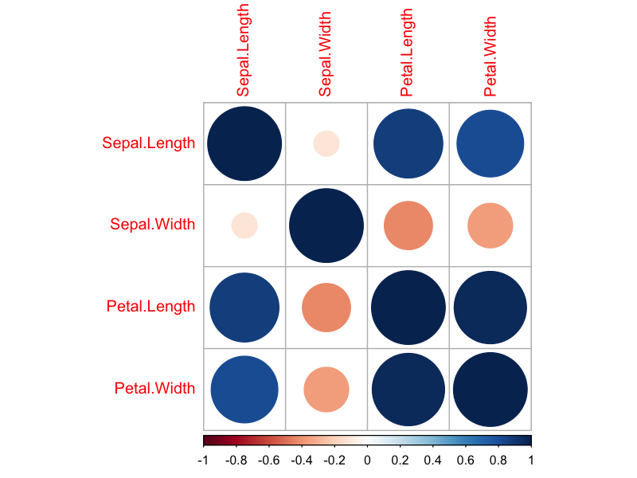

# Iris Correlation Plot

Plots the Pearson correlation matrix of the four numeric iris measurements. Circle size shows correlation magnitude and colour shows its sign and magnitude; the colour scale is placed below the matrix.

Run from this folder after installing the package loaded by the script:

```sh
Rscript iris_correlation_plot.R
```

The example uses built-in R data. No downloaded data or API key is required. Figure files are written to `figures/`.

Companion website: https://econometricsandtimeseries.com/



## About this example

Display Pearson correlations among the four numeric iris measurements. Circle size indicates magnitude, while colour distinguishes positive and negative correlations.

Notes updated: 11 October 2026.
