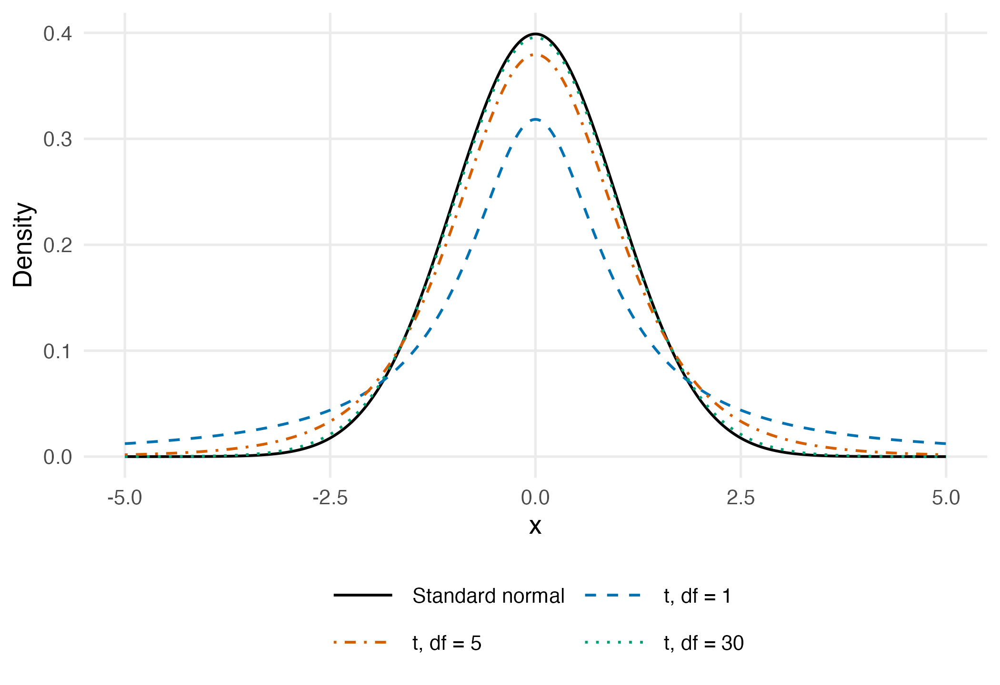

# Student t Normal Densities

Compares the analytic standard normal density with Student t densities at 1, 5 and 30 degrees of freedom. A two-row legend below the axes identifies every curve by colour and line type.

Run from this folder after installing the package loaded by the script:

```sh
Rscript student_t_normal_densities.R
```

The example uses analytic functions and fixed plotting coordinates. No downloaded data or API key is required. Figure files are written to `figures/`.

Companion website: https://econometricsandtimeseries.com/


