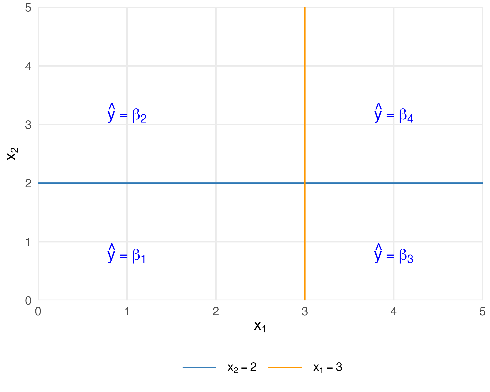

# CART Partition

Draws the four rectangular regions in Figure 10.1, with splits at x2 = 2 and x1 = 3. The region predictions match the associated regression tree. The split legend sits below the axes.

Run from this folder after installing the package loaded by the script:

```sh
Rscript cart_partition.R
```

The example uses analytic functions and fixed plotting coordinates. No downloaded data or API key is required. Figure files are written to `figures/`.

Companion website: https://econometricsandtimeseries.com/


