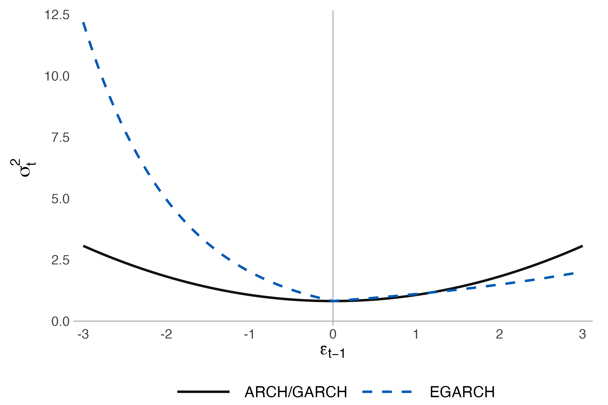

# News impact curves

Figure 4.1 in *Econometrics and Time Series Methods: Theory, Applications, and R Implementation* compares symmetric ARCH/GARCH and asymmetric EGARCH responses to an innovation.

The lagged conditional variance is held at one. The curves are

- **ARCH/GARCH, black solid line:** `exp(-0.2) + 0.25 * epsilon^2`.
- **EGARCH, blue dashed line:** `exp(-0.2 - 0.3 * epsilon + 0.6 * abs(epsilon))`.

The EGARCH curve uses the chapter's notation, with illustrative coefficients `omega = -0.2`, `gamma = -0.3`, `alpha = 0.6`, and `beta = 0.9`. The persistence term `beta * log(h_previous)` is zero because `h_previous = 1`. Both curves have the same variance at zero. The symmetric response is identical for positive and negative innovations of equal magnitude; the EGARCH response is larger for negative innovations.

Install `ggplot2` if needed, then run from this folder:

```r
source("news_impact_curves.R")
```

The script writes a PNG, a vector PDF and the plotted values as a CSV. The shared legend sits below the plot; its longer line samples distinguish solid and dashed lines at textbook size.


