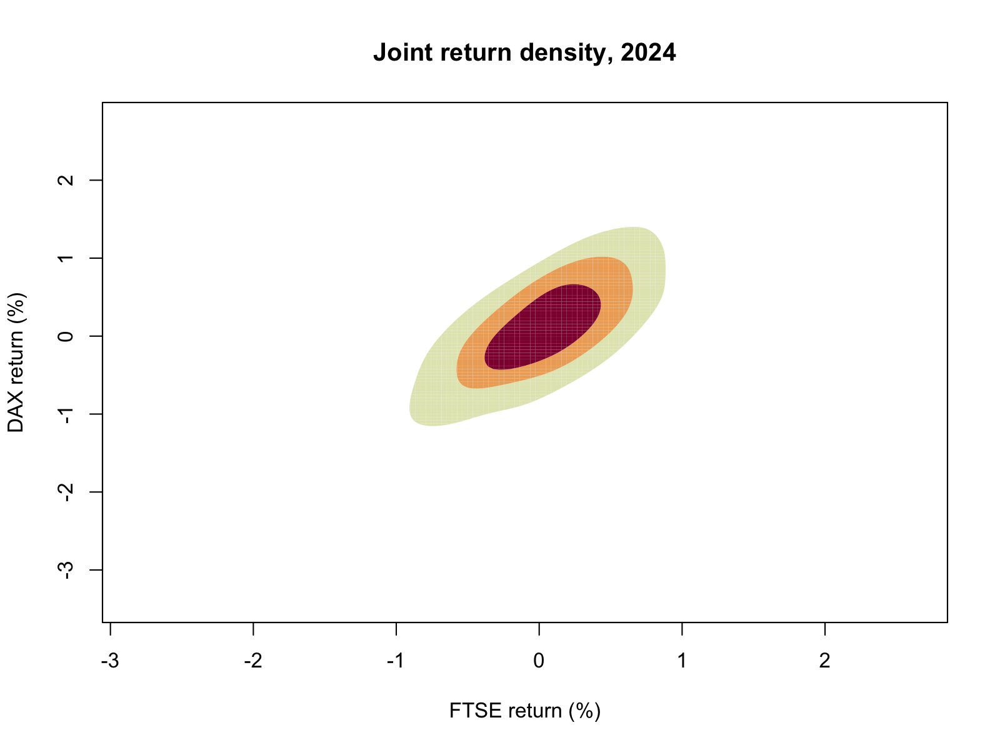
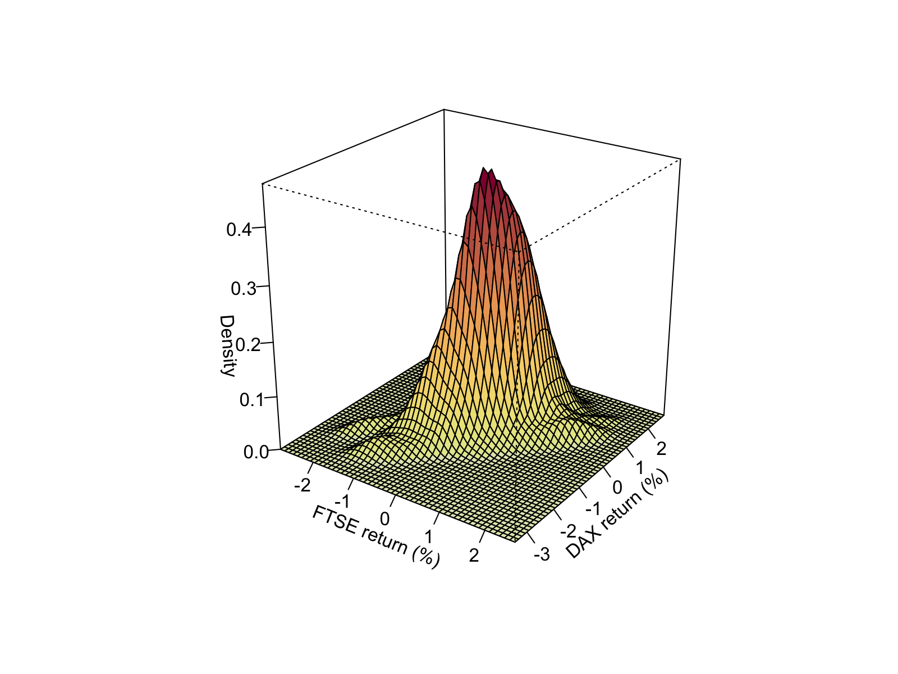

<div style="margin: 0; padding: 0; text-align: center; border: none;">
<a href="https://quantlet.com" target="_blank" style="text-decoration: none; border: none;">

</a>
</div>

```
Name of Quantlet: FTSE_DAX_Multivariate_KDE

Published in: Econometrics_R

Description: Aligns FTSE and DAX trading dates in 2024 and estimates their joint daily log-return density. The accompanying closing-price snapshots provide the inputs for contour and perspective plots.


Keywords: Econometrics, Financial Econometrics, FTSE 100, DAX, Multivariate Kernel Density, KDE, Joint Distribution, Quantmod, ks, Yahoo Finance, R

Author: Jiajing Sun

Submitted: 22 November 2025

```

## Running this example

Set the working directory to this folder and install the packages loaded at the start of the script. Then run:

```sh
Rscript "ftse_dax_multivariate_kde.R"
```

Keep these data files beside the script:

- `DAX_close_2024.csv`
- `FTSE_close_2015_2024.csv`

These are the saved market-data observations used by the revised example. Dates and column names are retained in the CSV files.

Book and companion materials: https://econometricsandtimeseries.com/




