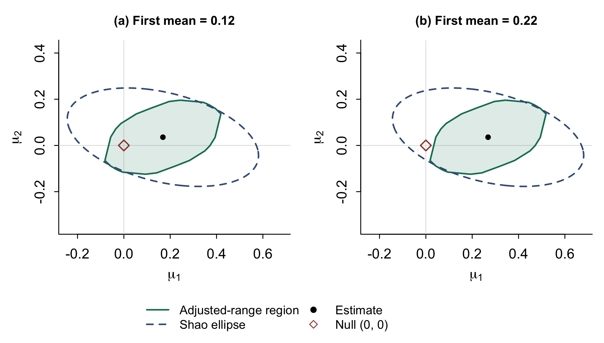

# Multivariate self-normalization with aersn

This example accompanies Chapter 6 of *Econometrics and Time Series Methods: Theory, Applications, and R Implementation*.

It constructs nominal 95% joint confidence regions for the mean of a bivariate VAR(1), using the increment-hull adjusted-range method and Shao's quadratic method. The same estimate and centred influence path are used for both methods, with a separate Brownian reference law for each. A second example estimates two regression slopes while retaining the effect of the estimated intercept in their influence contributions.

## Code used in the book

| Example | Complete script | Objects used by the printed excerpt |
| --- | --- | --- |
| Two dependent means | [aersn_multivariate_inference.R](aersn_multivariate_inference.R) | Creates its own data and reference draws. |
| Changing coordinates | [aersn_multivariate_inference.R](aersn_multivariate_inference.R), `AFFINE CHECK` block | Continues from the preceding mean example. |
| When the two tests disagree | [aersn_different_decisions.R](aersn_different_decisions.R), `DIFFERENT DECISIONS` block | The complete script recreates the original sample before applying the shift. |
| Transforming the shifted sample | [aersn_different_decisions.R](aersn_different_decisions.R), `DECISION AFFINE CHECK` block | Continues from the preceding comparison. |
| Selected regression coefficients | [aersn_regression_targets.R](aersn_regression_targets.R) | Reads `simulated_vector_series.csv` and `reference_draws.rds` produced by the first script. |

The QR codes beside the book's R examples open the corresponding sections below. Each section links to the complete script, including the setup omitted from continuation excerpts.

## Run

Install R 4.1 or later and `aersn` 0.2.3 or later:

```r
install.packages("aersn", repos = "https://cloud.r-project.org")
```

Use this folder as the working directory and run, in order:

```r
source("aersn_multivariate_inference.R")
source("aersn_regression_targets.R")
source("aersn_different_decisions.R")
source("aersn_decision_simulation.R")
```

The first script simulates 300 observations after a 500-observation burn-in, draws 10,000 Brownian reference statistics per method and saves the reference objects. The second reuses those objects because the target dimension and sample grid are unchanged. All data are simulated; no account, API key or data download is needed.

The third script also runs independently: it recreates the original data, raises the first mean by 0.10, and draws 100,000 Brownian reference statistics per method. The fourth uses the saved reference objects for a comparison over 5,000 new samples, together with 5,000 independent null samples for size calibration. These two scripts take longer than the original illustration.

## Results

The increment-hull and quadratic statistics are approximately 1.808 and 30.093, with simulated p-values 0.177 and 0.299. Each statistic is compared with its own reference law. The gauge critical value is about 2.510; the quadratic critical value is about 101.223. They are matched-grid approximations, not finite-sample exact critical values for general dependent observations.

## Changing coordinates

[Open the complete R script](aersn_multivariate_inference.R). The `AFFINE CHECK` block continues from the mean example, using `Y`, `test_h`, `test_s`, `ref_h` and `ref_s`. It transforms both the data and the null, then checks equality of the original and transformed statistics.

`aersn_joint_regions.pdf` and `.png` show the two confidence regions before and after an invertible transformation into sums and differences with a location shift. Both statistics are invariant. The polygon and ellipse cross, so neither contains the other in this realization.


`simultaneous_intervals.csv` contains projections of the full joint region, all using the two-dimensional critical value. These are simultaneous intervals; separate scalar intervals would answer a different question. `method_comparison.csv` contains the two tests. The two CSV datasets are the exact simulated inputs used for the figures and regression example.

The code also checks the quadratic statistic against its matrix formula, the two-dimensional gauge against supporting edges, the contrast intervals against projected ranges, the scalar reduction and the transformed polygon. The regression script independently forms the OLS influences. `validation.txt` and `regression_validation.txt` record the discrepancies. Package and R versions appear in `sessionInfo.txt`.

## An example with different decisions

[Open the complete R script](aersn_different_decisions.R). It recreates the original sample, so it can be run on its own from this directory. The printed comparison is marked `DIFFERENT DECISIONS`.

Keep the original centred observations and change the population mean from `(0.12, -0.06)` to `(0.22, -0.06)`. Both tests still examine the joint null `(0, 0)`.

| Method | Statistic | 5% critical value | Simulated p-value | Reject at 5%? |
| --- | ---: | ---: | ---: | --- |
| Adjusted range, increment hull | 2.9398 | 2.5516 | 0.02408 | Yes |
| Shao, quadratic | 65.2147 | 105.3155 | 0.11810 | No |



The null lies outside the adjusted-range polygon but inside Shao's ellipse. Both methods are affine equivariant. Transforming the observations into their sum and difference, with a location shift, preserves their statistics and decisions when the null is transformed as well. The different decisions arise from the shape and calibration of the two regions.

`aersn_different_decisions.R` contains the printed code, direct formula checks and plotting code for Figure 6.6. Its seed is 61009 for the original observations and 61012 for the larger reference simulations. The saved objects are in `decision_reference_draws.rds`, the shifted sample in `shifted_vector_series.csv`, and the results in `different_decisions.csv` and `decision_affine_check.csv`.

## Transforming the shifted sample

[Open the complete R script](aersn_different_decisions.R). The `DECISION AFFINE CHECK` block follows the two-test comparison in the same script. It uses `Y2`, the two fitted tests and their reference objects, and checks that transforming the data and null preserves both statistics and decisions. Results are saved in [decision_affine_check.csv](decision_affine_check.csv).

## Selected regression coefficients

[Open the complete R script](aersn_regression_targets.R). Run `aersn_multivariate_inference.R` first to create the simulated regressors and Brownian reference objects. The `REGRESSION` block fits an intercept and two slopes, tests the slopes jointly and constructs a simultaneous interval for their sum. The remaining code independently checks the OLS influence calculation. The simulated regression data are saved in [simulated_regression_data.csv](simulated_regression_data.csv).

## Rejection frequencies

`aersn_decision_simulation.R` evaluates every replication at three fixed means. Both methods use the same observations, and all three means share the same innovations within each replication. All 5,000 evaluation replications are retained.

| Population mean | Brownian: adjusted range | Brownian: Shao | VAR-calibrated: adjusted range | VAR-calibrated: Shao |
| --- | ---: | ---: | ---: | ---: |
| `(0, 0)` | 0.0552 | 0.0480 | 0.0488 | 0.0448 |
| `(0.12, -0.06)` | 0.3570 | 0.2900 | 0.3354 | 0.2770 |
| `(0.22, -0.06)` | 0.6646 | 0.5380 | 0.6436 | 0.5228 |

The first row estimates size; the other rows estimate power. At the larger alternative, only the adjusted-range method rejects in 14.96% of samples, and only Shao's method rejects in 2.30%, using the Brownian references.

The size-calibrated critical values (2.6103 and 108.8402) use 5,000 separate samples from the known zero-mean VAR, with seed 61013. Evaluation uses fresh samples with seed 61014. The larger alternative retains a power difference of 0.1208; its paired Monte Carlo standard error is 0.0056, conditional on the simulated critical values. The gain concerns this model and these mean directions, not every alternative.

The complete results, critical values and individual replication statistics are in `decision_size_power.csv`, `decision_cutoffs.csv`, `decision_null_calibration.csv` and `decision_evaluation_statistics.csv`. The two-dimensional hull gauge is calculated from all supporting edges, without a direction grid approximation. Package comparisons and affine invariance checks are recorded in `decision_validation.txt` and `decision_simulation_validation.txt`.

## References

- Hong, Y., Lin, Z., Linton, O., Newey, W. K. and Sun, J. (2026). [Affine-Equivariant Adjusted-Range Self-Normalization](https://www.janeway.econ.cam.ac.uk/publication/affine-equivariant-adjusted-range-self-normalization). Cambridge Working Papers in Economics No. 2678; Janeway Institute Working Paper No. 2637.
- Shao, X. (2010). [A self-normalized approach to confidence interval construction in time series](https://doi.org/10.1111/j.1467-9868.2009.00737.x). *Journal of the Royal Statistical Society: Series B*, 72(3), 343–366.
- Hong, Y., Linton, O., McCabe, B., Sun, J. and Wang, S. (2024). [Kolmogorov–Smirnov type testing for structural breaks: A new adjusted-range based self-normalization approach](https://doi.org/10.1016/j.jeconom.2023.105603). *Journal of Econometrics*, 238(2), 105603.
- [aersn package documentation](https://cran.r-universe.dev/aersn).

The componentwise multivariate critical values in the neighbouring `SelfNormalized_M_S_Critical_Values` example are for a different statistic. They are not the increment-hull gauge critical values used here.

## Drawing the joint regions

The book prints the complete `REGION PLOT` block from [aersn_multivariate_inference.R](aersn_multivariate_inference.R). It continues from the mean and affine-transformation examples, using `Y`, `mu`, `n`, `region_h`, `region_s`, `H` and `b`. The block constructs both boundaries, transforms their vertices, and saves Figure 6.5 as PDF and PNG.

## Drawing the two decisions

The book prints the complete `DECISION PLOT` block from [aersn_different_decisions.R](aersn_different_decisions.R). It uses the preceding `Y2`, `fit2`, `ref_h2`, `s2` and `n`. The two panels share the 100,000-draw reference distributions and axis limits. The block saves Figure 6.6 as PDF and PNG.
