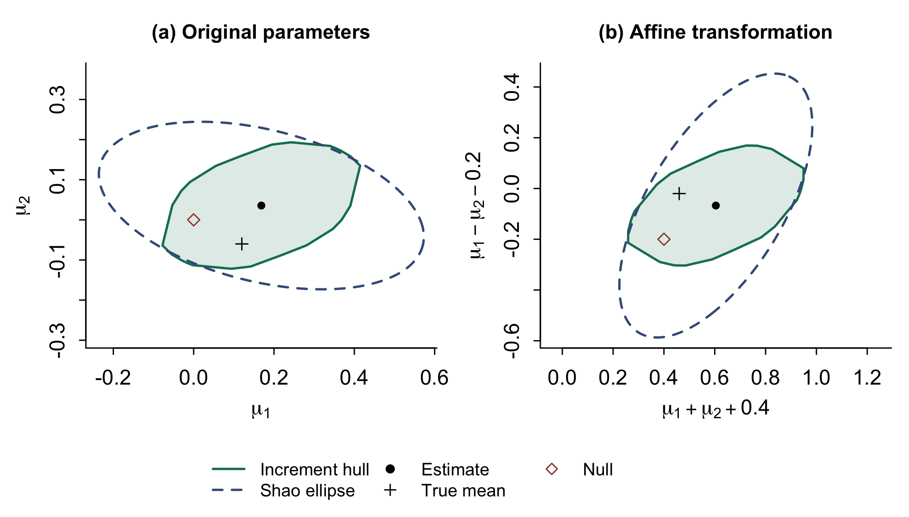

# Multivariate self-normalization with aersn

This example accompanies Chapter 6 of *Econometrics and Time Series Methods: Theory, Applications, and R Implementation*.

It constructs nominal 95% joint confidence regions for the mean of a bivariate VAR(1), using the increment-hull adjusted-range method and Shao's quadratic method. The same estimate and centred influence path are used for both methods, with a separate Brownian reference law for each. A second example estimates two regression slopes while retaining the effect of the estimated intercept in their influence contributions.

## Run

Install R 4.1 or later and `aersn` 0.2.3 or later:

```r
install.packages("aersn", repos = "https://cloud.r-project.org")
```

Use this folder as the working directory and run, in order:

```r
source("aersn_multivariate_inference.R")
source("aersn_regression_targets.R")
```

The first script simulates 300 observations after a 500-observation burn-in, draws 10,000 Brownian reference statistics per method and saves the reference objects. The second reuses those objects because the target dimension and sample grid are unchanged. All data are simulated; no account, API key or data download is needed.

## Results

The increment-hull and quadratic statistics are approximately 1.808 and 30.093, with simulated p-values 0.177 and 0.299. Each statistic is compared with its own reference law. The gauge critical value is about 2.510; the quadratic critical value is about 101.223. They are matched-grid approximations, not finite-sample exact critical values for general dependent observations.

`aersn_joint_regions.pdf` and `.png` show the two confidence regions before and after an invertible transformation into sums and differences with a location shift. Both statistics are invariant. The polygon and ellipse cross, so neither contains the other in this realization.



`simultaneous_intervals.csv` contains projections of the full joint region, all using the two-dimensional critical value. These are simultaneous intervals; separate scalar intervals would answer a different question. `method_comparison.csv` contains the two tests. The two CSV datasets are the exact simulated inputs used for the figures and regression example.

The code also checks the quadratic statistic against its matrix formula, the two-dimensional gauge against supporting edges, the contrast intervals against projected ranges, the scalar reduction and the transformed polygon. The regression script independently forms the OLS influences. `validation.txt` and `regression_validation.txt` record the discrepancies. Package and R versions appear in `sessionInfo.txt`.

## References

- Hong, Y., Lin, Z., Linton, O., Newey, W. K. and Sun, J. (2026). [Affine-Equivariant Adjusted-Range Self-Normalization](https://www.janeway.econ.cam.ac.uk/publication/affine-equivariant-adjusted-range-self-normalization). Cambridge Working Papers in Economics No. 2678; Janeway Institute Working Paper No. 2637.
- Shao, X. (2010). [A self-normalized approach to confidence interval construction in time series](https://doi.org/10.1111/j.1467-9868.2009.00737.x). *Journal of the Royal Statistical Society: Series B*, 72(3), 343–366.
- Hong, Y., Linton, O., McCabe, B., Sun, J. and Wang, S. (2024). [Kolmogorov–Smirnov type testing for structural breaks: A new adjusted-range based self-normalization approach](https://doi.org/10.1016/j.jeconom.2023.105603). *Journal of Econometrics*, 238(2), 105603.
- [aersn package documentation](https://cran.r-universe.dev/aersn).

The componentwise multivariate critical values in the neighbouring `SelfNormalized_M_S_Critical_Values` example are for a different statistic. They are not the increment-hull gauge critical values used here.
