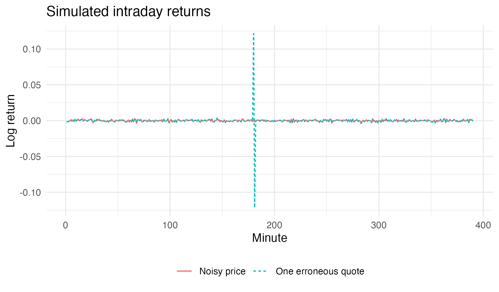
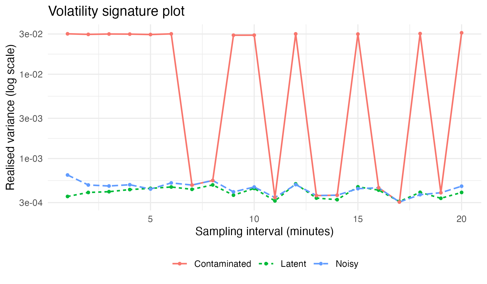

<div style="margin: 0; padding: 0; text-align: center; border: none;">
<a href="https://quantlet.com" target="_blank" style="text-decoration: none; border: none;">

</a>
</div>

```
Name of Quantlet: HF_Realized_Volatility_AlphaVantage

Published in: Econometrics_R

Description: Simulates one trading day of latent log prices, measurement noise and an isolated bad quote. The figures compare observed returns and realised variance. All prices in this example are simulated; no market-data account is required.


Keywords: high-frequency data, realized volatility, log-returns, aggregation, market microstructure, simulation, R

Author: Jiajing Sun

Submitted: 29 April 2025

Datafile: None; prices are simulated within the script.

See also: Intraday_Fixed_Sample, GBM_MLE_Approx_vs_Exact_Diagnostics

```

## Running this example

Set the working directory to this folder and install the packages loaded at the start of the script. Then run:

```sh
Rscript "hf_realized_volatility_alpha_vantage.R"
```

Book and companion materials: https://econometricsandtimeseries.com/




